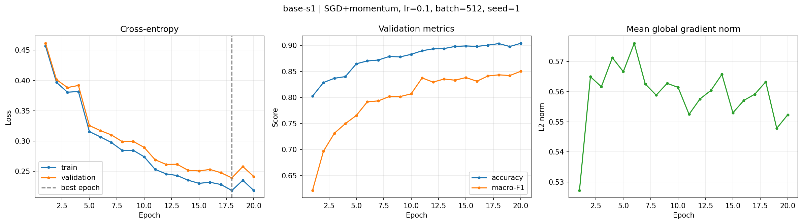
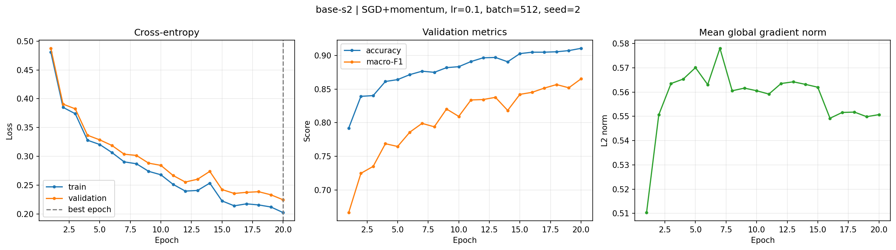
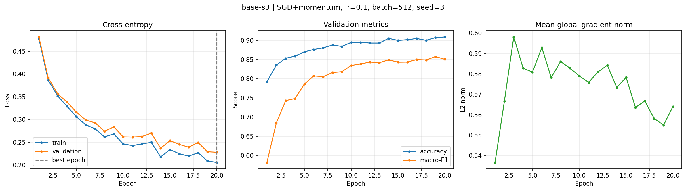
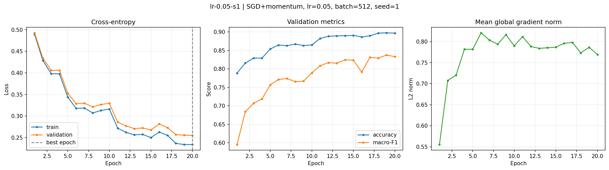
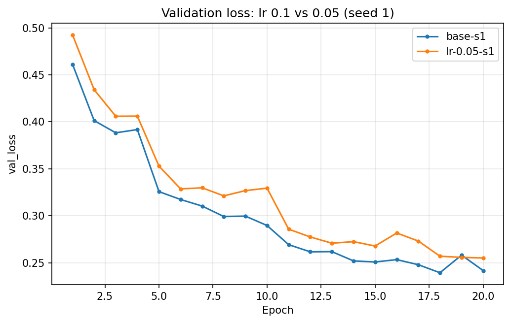
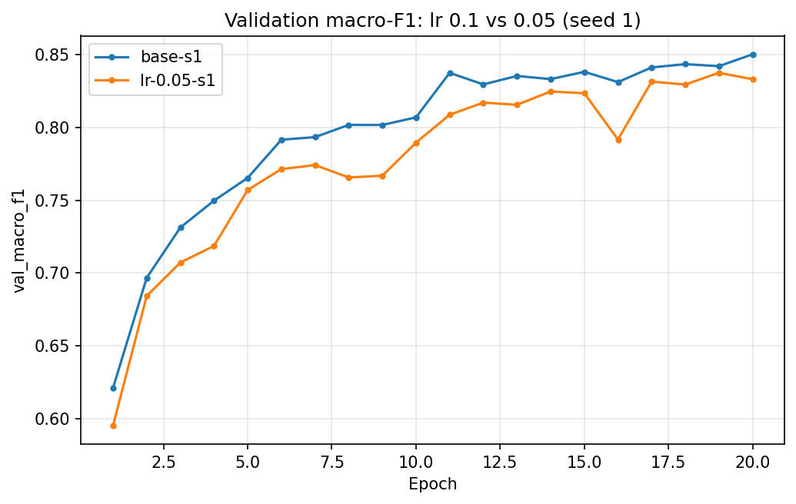

# Báo cáo thí nghiệm — Forest CoverType

## Thiết lập và cách chọn mô hình

- Dữ liệu có 54 đặc trưng; chuẩn hoá 10 cột liên tục bằng thống kê train, giữ nguyên 44 cột nhị phân. Tách train/validation phân tầng với `seed=42`; tập eval chỉ dùng ở bước chấm cuối.
- Mô hình M-base: `54 → 256 → 128 → 7`, 47.879 tham số; cross-entropy, SGD + momentum 0,9, batch 512, 20 epoch, He init. Learning rate được chọn trên validation: `0.1` tốt nhất trong vòng sàng lọc (0,01 / 0,03 / 0,1).
- Chọn `base-s2` làm cấu hình cuối vì có validation macro-F1 cao nhất trong ba seed baseline. Sau khi chọn, chạy evaluator chính thức đúng một lần trên eval; không dùng kết quả eval để chỉnh mô hình.

## Kết quả validation

| Thí nghiệm | Seed | LR | Best epoch | Val loss | Val accuracy | Val macro-F1 |
|---|---:|---:|---:|---:|---:|---:|
| base-s1 | 1 | 0.10 | 18 | 0.2393 | 0.9035 | 0.8434 |
| base-s2 | 2 | 0.10 | 20 | 0.2246 | 0.9109 | 0.8654 |
| base-s3 | 3 | 0.10 | 20 | 0.2280 | 0.9090 | 0.8505 |
| lr-0.05-s1 | 1 | 0.05 | 20 | 0.2550 | 0.8967 | 0.8331 |

Ba seed baseline đạt macro-F1 `0.8531 ± 0.0112` và accuracy `0.9078 ± 0.0038` (trung bình ± độ lệch chuẩn mẫu). LR 0.05 thấp hơn baseline seed 1 về macro-F1 `0.0104`; chênh lệch nhỏ hơn ngưỡng tham khảo `2σ=0.0224`. Thí nghiệm LR 0.05 chỉ có một seed nên chưa đủ cơ sở kết luận tổng quát. Đường loss/metric có dao động nhẹ.

Mỗi thí nghiệm có một ảnh riêng khớp với `exp_id`; hai ảnh so sánh nhóm được tách riêng.

### Per-run figures

### Learning-rate comparison

## Đánh giá cuối trên eval

Evaluator chính thức (`scripts/evaluate.py`) chấm đủ `116.203` dự đoán: accuracy `0.910071` và macro-F1 `0.865881`.

| Lớp | Số mẫu | Precision | Recall | F1 |
|---:|---:|---:|---:|---:|
| 0 | 42.368 | 0.9131 | 0.9005 | 0.9067 |
| 1 | 56.661 | 0.9168 | 0.9301 | 0.9234 |
| 2 | 7.151 | 0.9205 | 0.8838 | 0.9018 |
| 3 | 549 | 0.8042 | 0.8379 | 0.8207 |
| 4 | 1.899 | 0.7947 | 0.7256 | 0.7586 |
| 5 | 3.473 | 0.8036 | 0.8379 | 0.8204 |
| 6 | 4.102 | 0.9247 | 0.9344 | 0.9296 |

Lớp 4 có F1 thấp nhất; 436 mẫu lớp 4 bị dự đoán thành lớp 1. Lớp 3 ít mẫu nhất nhưng F1 cao hơn lớp 4, nên confusion matrix chưa đủ để quy nguyên nhân cho mất cân bằng. Lớp 2 và 5 cũng nhầm lẫn hai chiều (511 và 324 mẫu). Không điều chỉnh mô hình dựa trên các lỗi eval.

## Bằng chứng và giới hạn

- `eval_result.json`: đầu ra evaluator, gồm accuracy, macro-F1, per-class và confusion matrix.
- `predictions_eval.csv`: dự đoán theo `row_id`; `experiments.xlsx`: cấu hình, metric validation/eval và tổng hợp seed; `results/<exp_id>.json`: lịch sử từng epoch. Các kết quả cuối khớp nhau.
- Bằng chứng là một lần chia validation cố định, ba seed cho baseline và một seed cho thử nghiệm LR 0.05. Phạm vi thí nghiệm hẹp; không kết luận các thay đổi nhỏ là có ý nghĩa thống kê.
